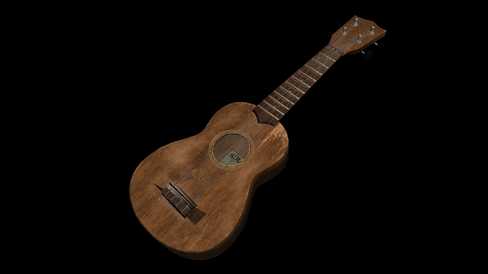
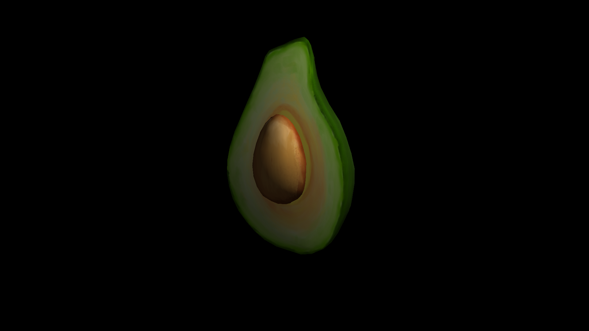

# Software-Rasterizer

C++ Sofware Rasterizer using only standard libraries.  
Reads a single OBJ model and a TGA image texture and writes the rendered image to a file.  
Loading of both file formats is rudimentary and only basic formats are supported.  
Apart from rasterization the rest of the Pipeline is implemented in a straighforward and unoptimized way. The math library is barebones and only implements what is needed.    
Rasterization is multithreaded by splitting the image into tiles, which are assigned to threads.  
The baryzentric coordinates are computed iteratively, as described in "A Parallel Algorithm for Polygon Rasterization".  
SIMD instructions are used to process four pixels at a time.

Ukulele model from [here](https://3dmodelhaven.com/model/?c=instrument&m=Ukulele_01).

Avocado model from [here](https://github.com/KhronosGroup/glTF-Sample-Models/tree/master/2.0/Avocado).

# Build instructions
Only tested on Windows. As only standard libraries are used the code should work on any C++ 17 compiler out of the box.  
Precompiled headers are setup to work with Visual Studio.  

The application relies on a "resources" folder. It has to contain the specified model and texture. The resulting image is written into the resource folder. The folder is searched along the path of the working directory.  

# References
https://github.com/ssloy/tinyrenderer/wiki/Lesson-0:-getting-started  
https://www.scratchapixel.com/lessons/3d-basic-rendering/rasterization-practical-implementation  
"A Parallel Algorithm for Polygon Rasterization" Juan Pineda 1988  
